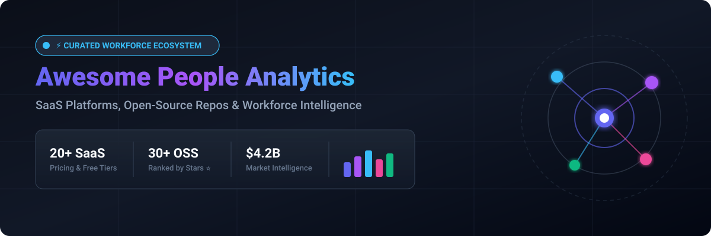

<div align="center">

<p align="center">
  
</p>

# 🚀 Awesome People Analytics Platform 🌟

**Curated ecosystem of SaaS platforms, open-source projects, data architectures, and AI tools for workforce intelligence, HR analytics, and talent analytics.**

<p align="center">
  <a href="https://github.com/ishandutta2007/Awesome-Awesome-Awesome"></a><a href="https://discord.gg/jc4xtF58Ve"></a> <a href="https://github.com/ishandutta2007/Awesome-People-Analytics-Platform/stargazers"></a> <a href="https://github.com/ishandutta2007/Awesome-People-Analytics-Platform/network/members"></a> <a href="https://github.com/ishandutta2007/Awesome-People-Analytics-Platform/blob/main/LICENSE"></a> <a href="https://github.com/ishandutta2007/Awesome-People-Analytics-Platform/pulls"></a> <a href="https://github.com/ishandutta2007"></a>
</p>

<p align="center">
  <a href="#-table-of-contents">📑 Table of Contents</a> •
  <a href="#-saashosted-platforms">☁️ SaaS Platforms</a> •
  <a href="#-open-source-github-projects-ranked-by-stars-">💻 Open-Source Projects</a> •
  <a href="#️-recommended-architecture--frameworks">🏗️ Architecture</a> •
  <a href="#-how-to-contribute">🤝 Contribute</a> •
  <a href="#-star-history">📈 Star History</a>
</p>

</div>

---

## 🎯 Overview & SEO Keywords

> **Keywords**: `people analytics`, `workforce intelligence`, `hr analytics`, `employee turnover prediction`, `talent intelligence`, `headcount planning`, `diversity equity inclusion (DEI) analytics`, `organizational network analysis (ONA)`, `compensation analytics`, `hr data warehouse`, `dbt hr models`, `open source hrms`, `human capital management (HCM)`.

This repository tracks notable **SaaS/hosted platforms** and **open-source projects** for **People Analytics**. These tools help HR leaders, people operations teams, executives, workforce planners, data analysts, and engineers collect, integrate, analyze, visualize, and model workforce data across HRIS, ATS, payroll, engagement, performance, and employee survey systems.

### 📊 Core Analytical Capabilities
- 👥 **Headcount & Capacity Planning**: Forecasting headcount trends, departmental growth, and labor budgets.
- 📉 **Attrition & Retention Modeling**: Predictive turnover risks, survival analysis, and flight-risk drivers.
- 🌈 **Diversity, Equity & Inclusion (DEI)**: Representation metrics, promotion velocity, and pay parity analysis.
- 💵 **Compensation & Rewards Analytics**: Compa-ratios, salary bands, equity distribution, and market benchmarking.
- 🕸️ **Organizational Network Analysis (ONA)**: Mapping communication topologies, collaboration silos, and key influencers.
- 🎯 **Performance & Goal Alignment**: OKR tracking, review distributions, 360 feedback, and continuous enablement.
- 💬 **Employee Experience & Sentiment**: eNPS tracking, pulse survey NLP analysis, and lifecycle feedback loops.
- 🏛️ **Skills Intelligence & Internal Mobility**: Skills taxonomy mapping, talent marketplaces, and career pathways.

---

## 📑 Table of Contents
- [🎯 Overview & SEO Keywords](#-overview--seo-keywords)
- [☁️ SaaS/Hosted Platforms](#-saashosted-platforms)
- [💻 Open-Source GitHub Projects (Ranked by Stars ⭐)](#-open-source-github-projects-ranked-by-stars-)
- [🏗️ Recommended Architecture & Frameworks](#️-recommended-architecture--frameworks)
- [🤝 How to Contribute](#-how-to-contribute)
- [📈 Star History](#-star-history)
- [⚖️ Disclaimer & Ethical People Analytics](#️-disclaimer--ethical-people-analytics)

---

## ☁️ SaaS/Hosted Platforms

> 📊 **Sector Market Size & Industry Structure**: The global People Analytics and Workforce Intelligence software market is estimated at **~$4.2 Billion in 2026** (projected to reach **$7.5+ Billion by 2030** at a CAGR of ~14.5%, within the broader $40B+ HR tech industry). The sector is **moderately fragmented**: mega-cap enterprise cloud incumbents (Microsoft, Oracle, SAP, Workday, ADP) hold strong foundational HRIS market share, while high-growth, best-of-breed specialized vendors (Visier, One Model, Culture Amp, Lattice, Eightfold AI, ChartHop) capture substantial share for cross-platform data modeling, AI talent intelligence, and employee experience analytics.

| Platform | Description | Company Size / Valuation | Starting Pricing | Free Tier / Free Trial Limits |
| :--- | :--- | :--- | :--- | :--- |
| **Microsoft (Microsoft Viva Insights)** | Workplace analytics platform providing organizational and work-pattern insights based on aggregated collaboration data, supporting productivity, wellbeing, and organizational effectiveness analysis. | **$3.1T+ Market Cap** ($245B+ Annual Revenue) | **$4.00 / user / month** for Viva Insights standalone (full Microsoft Viva Suite available at **$12.00 / user / month** with annual commitment). | **Free forever tier**: Personal Insights is included at $0 with Microsoft 365 / Office 365 enterprise licenses (personal wellbeing, focus time, quiet hours). Premium features offer a **30-day free trial** (up to 25 user licenses via M365 admin center). |
| **Oracle (Oracle Fusion HCM Analytics)** | Cloud HCM analytics ecosystem providing workforce reporting, talent analytics, workforce trends, and HR intelligence. | **$400B+ Market Cap** ($53B+ Annual Revenue) | Starts at **$15.00 / user / month** as Fusion Data Intelligence add-on (HCM Cloud core starting at ~$15.00 – $38.00 / employee / month; Creator analytics at ~$300 / user / month). | **30-day free trial** via Oracle Cloud Free Tier with **$300 in free cloud credits** and access to Always Free cloud analytics database services (no permanent free tier for HCM Analytics). |
| **Salesforce / Tableau (Tableau)** | Business intelligence and analytics platform widely used to build custom HR and people analytics dashboards for workforce, diversity, compensation, recruitment, and retention analysis. | **$280B+ Market Cap** ($35B+ Annual Revenue; acquired for $15.7B) | Starts at **$15.00 / user / month** for Tableau Viewer ($180/year billed annually); Tableau Explorer at **$42.00 / user / month**; Tableau Creator at **$75.00 / user / month**. | **Free forever tier**: Tableau Public is 100% free with limits of **10 GB storage** and **10 million rows per dataset** (publicly viewable dashboards). Commercial Tableau Cloud offers a **14-day free trial** with full Creator features (no credit card required). |
| **SAP (SAP SuccessFactors Workforce Analytics)** | Enterprise workforce analytics capabilities integrated with SAP human capital management systems for workforce planning, reporting, talent analytics, and strategic HR analysis. | **$260B+ Market Cap** ($34B+ Annual Revenue) | Starts at **$6.00 – $12.00 / employee / month** for core HR/analytics bundles (full enterprise suite spans $25.00 – $38.00 / employee / month). | **30-day free trial** for SAP SuccessFactors HCM suite (shared cloud environment pre-populated with workforce sample data and guided scenario workflows; no permanent free tier). |
| **ADP (ADP DataCloud)** | Workforce data and analytics ecosystem using aggregated workforce information and benchmarking capabilities to support HR decision-making and labor-market insights. | **$115B+ Market Cap** ($19B+ Annual Revenue) | Starts at **$10.00 – $20.00 / employee / month** (included in ADP Workforce Now mid-tier packages; executive benchmarking add-ons start at ~$3.00 – $5.00 / employee / month). | **30-day interactive self-guided demo environment** with preloaded compensation and turnover benchmark data across 30M+ employee records (no permanent free tier). |
| **Workday (Workday People Analytics)** | Workforce analytics capabilities integrated with Workday's HR and finance ecosystem, supporting workforce reporting, organizational analysis, talent insights, and people decision-making. | **$70B+ Market Cap** ($7.3B+ Annual Revenue) | Starts at **$34.00 – $42.00 / employee / month** (FSE worker basis as part of Workday HCM subscription; enterprise annual contracts typically start at $100,000+/year). | **30-day free trial** for Workday Adaptive Planning sandbox environment (includes sample financial and workforce data modeling; core People Analytics evaluated via guided interactive tours; no permanent free tier). |
| **UKG (UKG Pro)** | Human capital management platform with workforce analytics and reporting capabilities across employee data, workforce management, payroll, attendance, and talent processes. | **~$35B Valuation** ($4.3B+ Annual Revenue) | Starts at **$26.00 – $41.00 / employee / month** (bundled with core HCM, payroll, and workforce analytics; minimum annual contracts apply). | **14-day guided evaluation sandbox** provided during vendor proof-of-concept (includes sample HR data and pre-built compliance/retention dashboards; no permanent free tier). |
| **Sage Group (Sage People)** | Cloud HR and people management platform with workforce reporting and analytics capabilities for employee data, workforce trends, and HR operations. | **~$14B Market Cap** ($2.8B+ Annual Revenue) | Starts at **$6.50 / employee / month** for Sage HR core module (Sage People enterprise edition starts at ~$12.00 / employee / month with implementation starting at ~$25,000 – $35,000). | **30-day free trial** for Sage HR cloud module (full access to core HR, leave management, and employee records without credit card; no permanent free tier). |
| **Qualtrics (Qualtrics Employee Experience)** | Employee experience and people analytics platform supporting employee surveys, engagement measurement, feedback analytics, experience management, and workforce insights. | **~$12.5B Valuation** ($1.5B+ Annual Revenue) | Starts at **$125.00 / month** ($1,500/year) for individual research seats (EmployeeXM enterprise platform starts at ~$5.00 / employee / month or ~$25,000/year base contract). | **Free forever tier** with limits of **3 active surveys**, **100 responses per survey**, and **8 question types**. Paid research/XM tiers offer a **30-day free trial** with up to 1,000 responses and advanced reporting templates. |
| **Lattice** | People success platform providing performance management, engagement measurement, compensation workflows, HR analytics, and people insights. | **~$3.0B Valuation** (~$130M ARR) | Starts at **$8.00 / seat / month** for Goals/OKRs or **$11.00 / seat / month** for Performance & Analytics (modules bundle at ~$19.00 – $25.00 / seat / month; minimum annual contract of $4,000/year). | **14-day interactive test workspace** and guided pilot sandbox upon sales request (includes sample review cycles, 1-on-1 meeting templates, and people analytics dashboards; no permanent free tier). |
| **HiBob (Bob)** | Modern HR platform with people analytics and workforce reporting capabilities covering employee information, organizational metrics, engagement, compensation, and workforce trends. | **~$2.7B Valuation** (~$100M ARR) | Starts at **$8.00 – $10.00 / employee / month** (base Bob platform with analytics; minimum annual contract starting around $3,000 – $5,000/year). | **14-day interactive guided trial tour** and sandbox environment upon request (access to core HR analytics, sample headcount reports, and employee profile workflows; no permanent free tier). |
| **Eightfold AI** | Talent intelligence platform using AI for workforce skills, talent mobility, recruiting, workforce planning, and people intelligence. | **~$2.1B Valuation** (~$100M ARR) | Starts at **$7.00 – $10.00 / employee / month** (for mid-to-large enterprises with 1,000+ employees; annual minimum contract typically ~$50,000+/year). | **30-day proof-of-concept (POC) sandbox** during enterprise evaluation (allows ingestion of sample employee profiles to test AI skills matching and career pathing algorithms; no permanent free tier). |
| **Culture Amp** | Employee experience platform focused on engagement, employee feedback, performance, retention, and people analytics. | **~$1.5B Valuation** (~$120M ARR) | Starts at **$4.00 – $4.50 / employee / month** for single module (e.g., Engage or Perform; minimum annual contract of ~$4,500/year; 3-module bundle at ~$11.00 – $14.00 / employee / month). | **14 to 30-day pilot program** for enterprise evaluations (enables running 1 test pulse survey with up to 50 employees and generating sample engagement reports; no permanent free tier). |
| **Visier** | Enterprise people analytics platform that integrates workforce and business data to provide standardized workforce metrics, workforce intelligence, visual analytics, and answers to complex people questions. | **~$1.0B+ Valuation** (~$100M ARR) | Starts at **$4.50 – $5.00 / employee / month** (billed annually; minimum contract typically starts at ~$25,000/year for enterprise deployment). | **30-day free trial** for the Visier Alpine platform sandbox (includes pre-built content, 1 workspace, and sample or custom data upload; no credit card required; no permanent free tier). |
| **Gloat** | Talent marketplace and workforce intelligence platform focused on skills visibility, internal mobility, talent deployment, and workforce analytics. | **~$1.0B Valuation** (~$50M ARR) | Starts at **$6.00 – $8.00 / employee / month** (billed annually for enterprise workforce deployments; typical minimum commitment ~$40,000 – $60,000/year). | **30-day structured proof-of-concept (POC) pilot** (includes skills ontology setup for a test department of up to 100 employees and internal opportunity matching; no permanent free tier). |
| **ChartHop** | People operations and workforce planning platform combining organizational charts, headcount planning, compensation data, employee information, and people analytics. | **~$450M Valuation** (~$25M ARR) | Starts at **$3.50 / employee / month** for ChartHop Basic/Charts (Headcount Planning and Compensation modules start at ~$8.00 – $10.00 / employee / month with ~$9,000 annual minimum). | **14-day free trial** with full platform access; ChartHop Basic offers a **free forever tier** for small teams up to **35 employees** (org charts, basic profiles, and direct reporting structure). |
| **Betterworks** | Performance management and people enablement platform supporting goals, feedback, performance insights, and workforce analytics. | **~$300M Valuation** (~$35M ARR) | Starts at **$8.00 / user / month** for Goals & Performance (billed annually; comprehensive Enterprise suite starts at ~$15.00 / user / month). | **14-day pilot sandbox** available upon consultation (supports up to 25 test users, OKR tracking, continuous feedback loops, and basic manager analytics; no permanent free tier). |
| **One Model** | People analytics and workforce data platform focused on integrating HR data from multiple systems into a unified workforce data model, analytics environment, and reporting ecosystem. | **~$120M Valuation** (~$15M ARR) | Starts at **$3.00 – $6.00 / employee / month** (Essentials edition typically starts at ~$30,000 – $45,000/year for mid-market up to 2,500 employees). | **14 to 30-day guided POC / sandbox trial** during enterprise evaluation (limited to sample data and up to 5 administrative seats; no permanent free tier). |
| **Fuel50** | Talent marketplace and career intelligence platform supporting workforce skills, internal mobility, career development, and talent analytics. | **~$100M Valuation** (~$15M ARR) | Starts at **$4.50 – $7.00 / employee / month** (billed annually; scales based on employee volume with typical enterprise entry contracts at ~$30,000/year). | **30-day sandbox pilot** during sales evaluation (includes sample career architecture mapping, benchmarking tools, and career pathway simulations for up to 50 users; no permanent free tier). |
| **Crunchr** | Workforce analytics platform focused on workforce intelligence, HR reporting, diversity analytics, talent insights, and strategic people decision-making. | **~$50M Valuation** (~$10M ARR) | Starts at **$4.49 / user / month** for small business tiers (People Analytics enterprise tier starts at ~$2.50 – $4.50 / employee / month billed annually). | **7-day free trial** for standard business modules / **14-day guided analytics sandbox** (limited to sample employee datasets and up to 3 test users; no permanent free tier). |

---

## 💻 Open-Source GitHub Projects (Ranked by Stars ⭐)

The open-source People Analytics ecosystem enables organizations to construct transparent, customizable, self-hosted, and privacy-compliant workforce intelligence architectures. Below is the curated collection of leading open-source repositories sorted strictly in descending order by **GitHub Star Count**:

### 🔹 [PyTorch](https://github.com/pytorch/pytorch) [](https://github.com/pytorch/pytorch/stargazers)

Open-source machine-learning framework suitable for deep learning, NLP, and predictive models involving workforce skills, talent embeddings, and organizational dynamics.

### 🔹 [Grafana](https://github.com/grafana/grafana) [](https://github.com/grafana/grafana/stargazers)

Open-source visualization and metrics observability platform used to build interactive workforce trend dashboards, headcount monitors, and operational HR KPI walls.

### 🔹 [Apache Superset](https://github.com/apache/superset) [](https://github.com/apache/superset/stargazers)

Modern, enterprise-ready business intelligence web application and visualization platform suitable for self-hosted People Analytics dashboards covering headcount, attrition, diversity, and recruiting metrics.

### 🔹 [scikit-learn](https://github.com/scikit-learn/scikit-learn) [](https://github.com/scikit-learn/scikit-learn/stargazers)

Core machine-learning library in Python suitable for employee attrition forecasting, workforce segmentation, clustering, retention modeling, and predictive HR analytics.

### 🔹 [NocoDB](https://github.com/nocodb/nocodb) [](https://github.com/nocodb/nocodb/stargazers)

Open-source smart spreadsheet-database alternative to Airtable, perfect for HR teams managing employee directories, headcount planning, recruitment pipelines, and custom people workflows.

### 🔹 [Pandas](https://github.com/pandas-dev/pandas) [](https://github.com/pandas-dev/pandas/stargazers)

Foundational open-source Python library for tabular data manipulation, compensation modeling, turnover analysis, demographic slicing, and workforce reporting.

### 🔹 [Apache Spark](https://github.com/apache/spark) [](https://github.com/apache/spark/stargazers)

Unified engine for large-scale distributed data processing, ideal for enterprise-scale HR data lakes, longitudinal workforce modeling, and multi-source ETL pipelines.

### 🔹 [ClickHouse](https://github.com/ClickHouse/ClickHouse) [](https://github.com/ClickHouse/ClickHouse/stargazers)

High-performance open-source columnar analytical database designed for real-time aggregation across billions of employee event logs, time-tracking records, and historical HR metrics.

### 🔹 [Metabase](https://github.com/metabase/metabase) [](https://github.com/metabase/metabase/stargazers)

User-friendly open-source business intelligence and self-service analytics tool that connects directly to HR databases/warehouses for zero-code team reporting.

### 🔹 [Apache Airflow](https://github.com/apache/airflow) [](https://github.com/apache/airflow/stargazers)

Open-source platform to programmatically author, schedule, and monitor complex HR data ingestion pipelines, automated ETL workflows, and KPI mart refreshes.

### 🔹 [Appsmith](https://github.com/appsmithorg/appsmith) [](https://github.com/appsmithorg/appsmith/stargazers)

Open-source low-code framework to build internal HR apps, custom people analytics portals, compensation review tools, and employee directory management consoles.

### 🔹 [Polars](https://github.com/pola-rs/polars) [](https://github.com/pola-rs/polars/stargazers)

Blazing-fast open-source DataFrame library implemented in Rust, optimized for processing millions of employee event records, payroll datasets, and workforce transformations in seconds.

### 🔹 [Apache Kafka](https://github.com/apache/kafka) [](https://github.com/apache/kafka/stargazers)

Distributed event-streaming platform engineered for high-throughput, low-latency ingestion of real-time employee lifecycle events, system access logs, and HR events.

### 🔹 [DuckDB](https://github.com/duckdb/duckdb) [](https://github.com/duckdb/duckdb/stargazers)

High-performance, in-process analytical SQL database engine optimized for fast, local, reproducible People Analytics queries, embedded pipelines, and dbt models.

### 🔹 [PostHog](https://github.com/PostHog/posthog) [](https://github.com/PostHog/posthog/stargazers)

Open-source product and user analytics platform that tracks employee interactions across internal HR tools, employee self-service portals, intranets, and onboarding software.

### 🔹 [Redash](https://github.com/getredash/redash) [](https://github.com/getredash/redash/stargazers)

Open-source data visualization and SQL query platform enabling HR analysts to query various databases, build dashboards, and share people metrics across teams.

### 🔹 [Apache Flink](https://github.com/apache/flink) [](https://github.com/apache/flink/stargazers)

Open-source stream-processing framework for stateful computations over real-time workforce event streams, time-tracking events, and continuous operational analytics.

### 🔹 [Budibase](https://github.com/Budibase/budibase) [](https://github.com/Budibase/budibase/stargazers)

Open-source low-code platform for creating internal workforce tools, employee self-service forms, approval workflows, and performance tracking interfaces.

### 🔹 [Typebot](https://github.com/baptisteArno/typebot.io) [](https://github.com/baptisteArno/typebot.io/stargazers)

Open-source conversational form builder ideal for engaging employee onboarding surveys, pulse feedback collection, HR triage bots, and exit interview forms.

### 🔹 [ERPNext](https://github.com/frappe/erpnext) [](https://github.com/frappe/erpnext/stargazers)

Comprehensive open-source ERP system featuring built-in HR, payroll, attendance, leave management, and expense tracking modules to power people operations.

### 🔹 [Matomo](https://github.com/matomo-org/matomo) [](https://github.com/matomo-org/matomo/stargazers)

Privacy-first open-source web analytics platform suitable for measuring employee adoption, portal utilization, and documentation engagement on internal company intranets.

### 🔹 [MLflow](https://github.com/mlflow/mlflow) [](https://github.com/mlflow/mlflow/stargazers)

Open-source machine learning lifecycle platform useful for tracking, evaluating, versioning, and deploying workforce prediction models like attrition risk and promotion readiness.

### 🔹 [TimescaleDB](https://github.com/timescale/timescaledb) [](https://github.com/timescale/timescaledb/stargazers)

Open-source time-series PostgreSQL database engineered to track and analyze historical workforce metrics, headcount changes, absenteeism rates, and workforce capacity trends over time.

### 🔹 [Airbyte](https://github.com/airbytehq/airbyte) [](https://github.com/airbytehq/airbyte/stargazers)

Open-source ELT data integration platform with an extensive catalog of connectors to sync workforce data from HRIS, ATS, payroll APIs, and databases into modern data warehouses.

### 🔹 [Prefect](https://github.com/PrefectHQ/prefect) [](https://github.com/PrefectHQ/prefect/stargazers)

Modern Python workflow orchestration framework for automating HR data extraction, ML-driven attrition predictions, and scheduled workforce reporting.

### 🔹 [PostgreSQL](https://github.com/postgres/postgres) [](https://github.com/postgres/postgres/stargazers)

Powerful, open-source object-relational database system serving as a reliable transactional and relational foundation for employee records, organizational trees, and compensation tables.

### 🔹 [NetworkX](https://github.com/networkx/networkx) [](https://github.com/networkx/networkx/stargazers)

Python library for the creation, manipulation, and study of complex networks, widely used for Organizational Network Analysis (ONA) to assess employee collaboration and influence.

### 🔹 [Formbricks](https://github.com/formbricks/formbricks) [](https://github.com/formbricks/formbricks/stargazers)

Open-source survey and experience management suite suitable for running privacy-compliant employee Net Promoter Score (eNPS), satisfaction surveys, and pulse feedback loops.

### 🔹 [Dagster](https://github.com/dagster-io/dagster) [](https://github.com/dagster-io/dagster/stargazers)

Data orchestrator for machine learning, analytics, and ETL that enables asset-based workflows with built-in data quality lineage for trustworthy HR data engineering.

### 🔹 [Jupyter Notebook](https://github.com/jupyter/notebook) [](https://github.com/jupyter/notebook/stargazers)

Interactive web application for creating and sharing computational documents with live code, visualizations, and statistical models for reproducible workforce research.

### 🔹 [DataHub](https://github.com/datahub-project/datahub) [](https://github.com/datahub-project/datahub/stargazers)

Extensible open-source metadata platform and data catalog built for modern data stacks, useful for governing People Analytics data assets and tracking end-to-end data lineage.

### 🔹 [dbt Core](https://github.com/dbt-labs/dbt-core) [](https://github.com/dbt-labs/dbt-core/stargazers)

Open-source data transformation framework enabling analytics engineering workflows to build tested, version-controlled, and documented workforce KPI data marts from raw HRIS tables.

### 🔹 [Great Expectations](https://github.com/great-expectations/great_expectations) [](https://github.com/great-expectations/great_expectations/stargazers)

Data quality and validation framework that enforces data integrity checks on HRIS, ATS, and payroll datasets before they feed executive workforce dashboards.

### 🔹 [OpenSearch](https://github.com/opensearch-project/OpenSearch) [](https://github.com/opensearch-project/OpenSearch/stargazers)

Community-driven open-source search and analytics suite suitable for indexing employee skills profiles, internal job matching, analyzing survey text, and HR knowledge base search.

### 🔹 [Lightdash](https://github.com/lightdash/lightdash) [](https://github.com/lightdash/lightdash/stargazers)

Open-source BI platform natively integrated with dbt semantic models, enabling HR and people teams to build self-service workforce charts without writing SQL.

### 🔹 [Evidently](https://github.com/evidentlyai/evidently) [](https://github.com/evidentlyai/evidently/stargazers)

Open-source ML evaluation and monitoring library that detects data drift and performance degradation in predictive workforce models (e.g., turnover prediction, bias monitoring).

### 🔹 [OpenMetadata](https://github.com/open-metadata/OpenMetadata) [](https://github.com/open-metadata/OpenMetadata/stargazers)

All-in-one open-source metadata platform providing data discovery, data lineage, metric governance, and data quality tracking for enterprise People Analytics teams.

### 🔹 [Leantime](https://github.com/leantime/leantime) [](https://github.com/leantime/leantime/stargazers)

Open-source strategic project management system focused on human-centric productivity, goal alignment, OKR tracking, and team performance analytics.

### 🔹 [Apache Pinot](https://github.com/apache/pinot) [](https://github.com/apache/pinot/stargazers)

Real-time distributed OLAP datastore designed for low-latency analytical queries across massive employee event streams and real-time operational workforce metrics.

### 🔹 [Countly Server](https://github.com/Countly/countly-server) [](https://github.com/Countly/countly-server/stargazers)

Open-source product and user analytics platform designed for tracking employee journey interactions and engagement across enterprise mobile and web applications.

### 🔹 [Steampipe](https://github.com/turbot/steampipe) [](https://github.com/turbot/steampipe/stargazers)

Open-source zero-ETL engine to select and query APIs, cloud infrastructure, and HR identity providers using standard SQL for instant workforce identity and access analytics.

### 🔹 [Apache NiFi](https://github.com/apache/nifi) [](https://github.com/apache/nifi/stargazers)

Easy-to-use, powerful open-source system to process and distribute data across disparate enterprise HR systems, on-premises payroll databases, and cloud analytics warehouses.

### 🔹 [Rill](https://github.com/rilldata/rill) [](https://github.com/rilldata/rill/stargazers)

Fast, open-source operational BI tool that pairs with DuckDB and ClickHouse to provide ultra-fast, exploratory workforce dashboards and slice-and-dice people metrics.

### 🔹 [Evidence](https://github.com/evidence-dev/evidence) [](https://github.com/evidence-dev/evidence/stargazers)

Open-source code-based BI framework for building version-controlled, markdown-driven workforce reports and interactive HR analytics dashboards.

### 🔹 [Amundsen](https://github.com/amundsen-io/amundsen) [](https://github.com/amundsen-io/amundsen/stargazers)

Open-source data discovery and metadata engine created by Lyft that catalogs workforce datasets and makes employee data assets easily searchable for analytics teams.

### 🔹 [Meltano](https://github.com/meltano/meltano) [](https://github.com/meltano/meltano/stargazers)

Open-source ELT orchestration platform built on Singer taps/targets, ideal for creating modular data pipelines that extract data from HR platforms into people data warehouses.

### 🔹 [Frappe HR](https://github.com/frappe/hrms) [](https://github.com/frappe/hrms/stargazers)

Modern open-source HR and payroll management system for employee lifecycles, attendance, leaves, recruitment, performance appraisals, and structured workforce data collection.

### 🔹 [Horilla](https://github.com/horilla-opensource/horilla) [](https://github.com/horilla-opensource/horilla/stargazers)

Modern open-source HR software suite covering employee management, recruitment, attendance, leaves, payroll, and organization hierarchy reporting.

### 🔹 [Fairlearn](https://github.com/fairlearn/fairlearn) [](https://github.com/fairlearn/fairlearn/stargazers)

Open-source Python toolkit designed to assess and improve the fairness of machine learning systems, critical for eliminating bias in predictive HR, compensation, and hiring models.

### 🔹 [OrangeHRM Open Source](https://github.com/orangehrm/orangehrm) [](https://github.com/orangehrm/orangehrm/stargazers)

Long-standing open-source HR management system providing modular employee records, leave administration, time tracking, recruitment, and core HR data management.


---

## 🏗️ Recommended Architecture & Frameworks

```
┌──────────────────────────────────────────────────────────────────────────────────────────┐
│                             MODULAR OPEN-SOURCE HR STACK                                 │
└──────────────────────────────────────────────────────────────────────────────────────────┘
  📥 1. Operational Ingestion        ⚙️ 2. Storage & Transformation        📊 3. BI & Analytics
 ┌───────────────────────────┐      ┌───────────────────────────┐      ┌───────────────────────────┐
 │ • Frappe HR / ERPNext     │      │ • PostgreSQL / DuckDB     │      │ • Apache Superset         │
 │ • OrangeHRM / Horilla     │ ───► │ • ClickHouse / Timescale  │ ───► │ • Metabase / Lightdash    │
 │ • Airbyte / Meltano       │      │ • dbt Core (Semantic KPI) │      │ • Grafana / Evidence      │
 └───────────────────────────┘      └───────────────────────────┘      └───────────────────────────┘
                                                  │
                                                  ▼
                                    🧠 4. Predictive Intelligence
                                   ┌───────────────────────────┐
                                   │ • scikit-learn / PyTorch  │
                                   │ • Pandas / Polars         │
                                   │ • Fairlearn / Evidently   │
                                   └───────────────────────────┘
```

1. 📥 **Operational HR Foundation**: Deploy **Frappe HR**, **Horilla**, or **OrangeHRM** as your primary open-source system of record for employee profiles, leaves, and attendance.
2. 🔄 **Automated Data Ingestion**: Use **Airbyte** or **Meltano** to extract employee records, ATS candidates, payroll cycles, and engagement surveys on scheduled schedules.
3. 💾 **Analytical Data Layer**: Store analytical datasets in **PostgreSQL**, **DuckDB**, or **ClickHouse**.
4. 📐 **KPI Semantic Modeling**: Utilize **dbt Core** to build verified marts for headcount, voluntary turnover, absenteeism, and promotion parity.
5. 📊 **Self-Service Visualizations**: Connect **Apache Superset**, **Metabase**, or **Lightdash** to deliver role-based dashboards to HR business partners and executive teams.
6. 🤖 **Predictive HR & Bias Auditing**: Build turnover prediction and compensation models using **scikit-learn** and **pandas**, while safeguarding fairness using **Fairlearn** and tracking drift with **Evidently**.

---

## 🤝 How to Contribute

Contributions are welcome! To contribute:

1. 🍴 **Fork the repo** on GitHub.
2. 📝 **Add or update entries** in `README.md` (ensure descriptions are concise and factual).
3. 🏷️ **For SaaS entries**: Provide exact starting pricing, company size/valuation, and specific free tier / free trial limits.
4. ⭐ **For Open-Source entries**: Add the official repository and social star badge linking to the stargazers page.
5. 🚀 **Submit a Pull Request** with a brief summary of the addition.

---

## 📈 Star History

[](https://star-history.dera.page/#ishandutta2007/Awesome-People-Analytics-Platform&type=date&legend=top-left)

---

## ⚖️ Disclaimer & Ethical People Analytics

- 🔒 **Privacy & Security**: People Analytics handles sensitive employee records. Ensure compliance with GDPR, CCPA, and appropriate role-based access control (RBAC).
- ⚖️ **Fairness & Bias Mitigation**: Predictive machine learning models must undergo rigorous fairness checks before influencing recruitment, performance evaluations, or compensation decisions.
- 🤝 **Human in the Loop**: Analytical outputs should inform decision-making but never replace empathetic, accountable human leadership.

---

<div align="center">

**[Awesome-People-Analytics-Platform](https://github.com/ishandutta2007/Awesome-People-Analytics-Platform)** • Maintained with ❤️ by the community.

</div>
